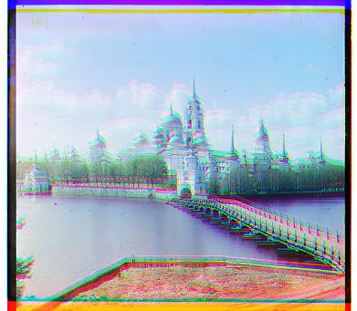

> All the algorithms in this repository is implemented using numpy. No built-in functions!

> There's a .py file and a jupyter notebook file. In the.ipynb file is all the code explanations needed.

# Prokudin-Goskii Images

_Sergei Mikhailovich Prokudin-Gorskii_ was a color photographer before his time, who undertook a photographic survey of the Russian Empire for Tsar Nicholas II. He was able to capture color by taking three pictures of each scene, each with a different red, green or blue color filter. Walter Frankhauser, a photographer contracted by the Library of Congress, manually registered and cleaned up some 120 of the original high-resolution scans, with breathtakingly beautiful results.
The results of his effort can be seen at the online-exhibit **[The Empire That Was Russia](http://www.loc.gov/exhibits/empire/)**.

  
   

# Colorizing Prokudin-Goskii Images

## The Intuitive Implementation

Probably the most intuitive implementation of this problem is to divid image into thirds and directly place them on top of each other. The final result in this implementation is not good. The borders and angles between each filtered image cause discrepancies that result in a slightly misaligned final image.

## Image Pyramid Alignment Implementation

The method implemented in this repository is using image pyramids to make almost exact alignments while keeping the speed in computation. First of all we resize image to 1/8 of what it already is and we begin to search the best possible alignment using norm of different channels. The interval is really small in this step. After we found an optimal solution to that, we make our alignment more percise by finding the best alignment on 1/4 image. If we suppose that the best alignment for channel G is \\((a, b)\\) then we only need to search for the best alignment in 1/4 image in a really small interval:

\\[ (2a - \sigma, 2b - \sigma) - (2a + \sigma, 2b + \sigma) \\]

Where \\(\sigma\\) is a really small value like 5px.

With this method we can find a good alignment by refferencing one of them and finding a best alignment for the other one. Since we use image pyramids our computation speed is fast.

Here are some of the results of this method:

- Train

  These 3 images are Blue, Green and Red channels of the image from left to right.

    

    
    
    
    

  The result from Intuitive implementation and Image Pyramid Implementation is looks like this. The Left image is the intuitive method and the right one is the image pyramid method.

    

    
    
    

- Mosque

    

    
    
    
    

    

    
    
    

- Amir

    

    
    
    
    

    

    
    
    

As we can observe there's a massive difference in the result of these two methods. Therefore we can find a really good alignment for big images in a reallly short time.

## Auto Crop

If we pay attention to the Intuitive method results we can see that there's an unwanted border that appears on the result image. In order to handle that we use Sobel Edge detection method and remove the unwanted borders so that the inal result is looks almost as good as a casual image.
Since there's lots of details in some images, the Sobel method may find some false edges. Therefor before edge detection process we use gaussian blur to smooth the details and noises.
